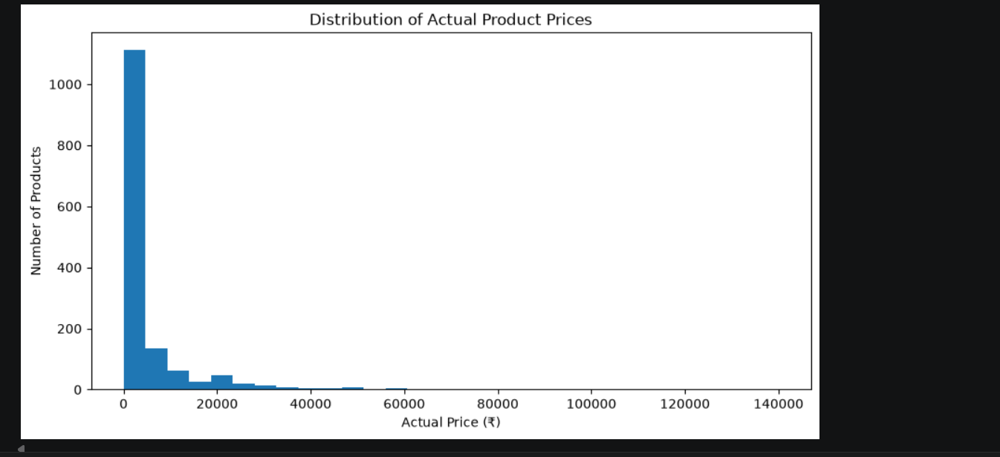
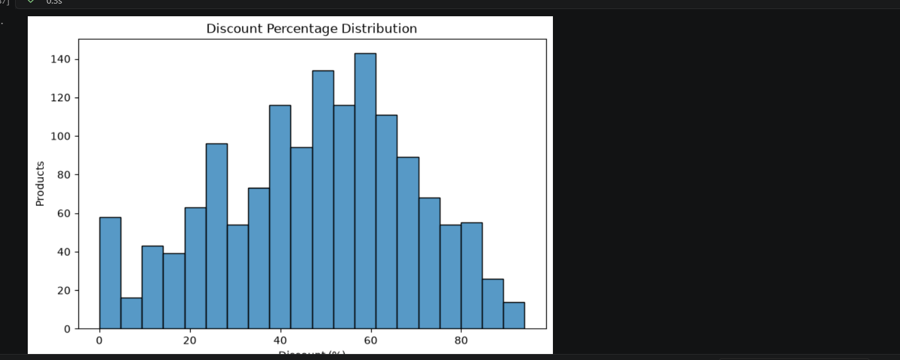
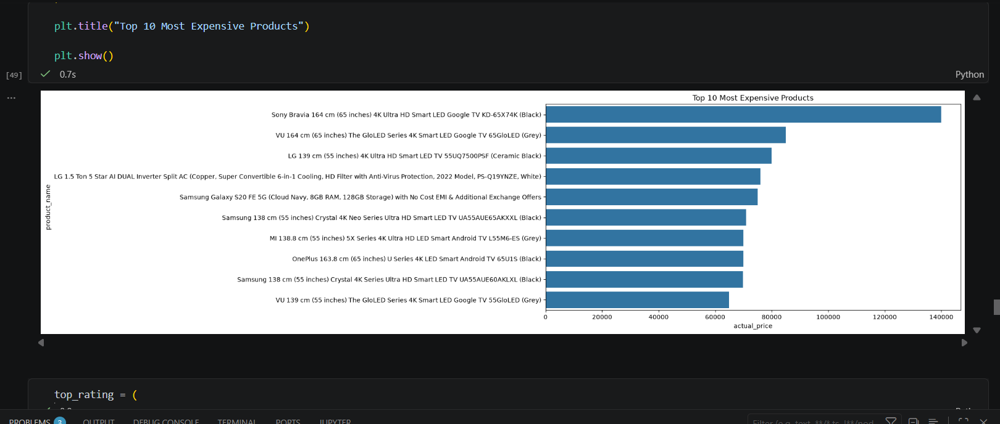
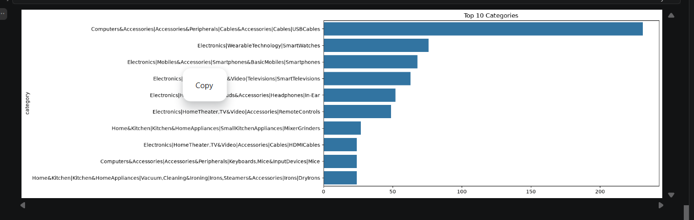
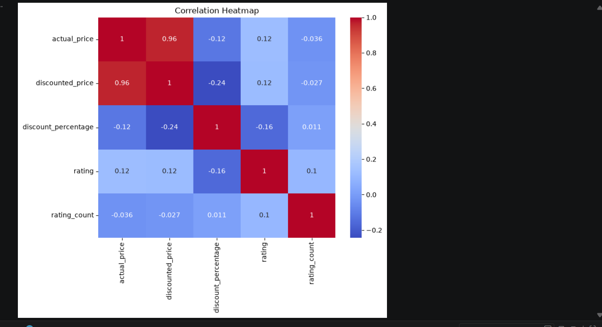

# 📊 Amazon Sales Analysis

A comprehensive Data Analysis project that explores Amazon product sales data using Python. This project focuses on data cleaning, exploratory data analysis (EDA), and visualization to uncover valuable business insights related to pricing, discounts, ratings, and product categories.

---

## 📌 Project Overview

The objective of this project is to analyze Amazon product data and identify meaningful patterns that can help understand product pricing strategies, customer ratings, and discount trends. The project demonstrates the complete data analysis workflow from raw data preprocessing to insightful visualizations.

---

## 🎯 Objectives

- Clean and preprocess raw Amazon product data
- Handle missing values and incorrect data types
- Analyze pricing and discount trends
- Explore customer ratings and review counts
- Identify top-performing products and categories
- Visualize business insights using charts and graphs

---

## 🛠️ Technologies Used

- Python
- Pandas
- NumPy
- Matplotlib
- Seaborn
- Jupyter Notebook

---

## 📂 Dataset Information

The dataset contains Amazon product information including:

- Product ID
- Product Name
- Category
- Actual Price
- Discounted Price
- Discount Percentage
- Product Rating
- Rating Count
- Product Description
- Customer Reviews

---

## 📊 Data Cleaning

The following preprocessing steps were performed:

- Removed missing values
- Converted price columns to numeric format
- Converted discount percentage to numeric values
- Converted ratings and rating counts to numeric format
- Removed currency symbols and commas
- Verified data types for analysis

---

## 📈 Exploratory Data Analysis (EDA)

The project includes the following analyses:

- Product Price Distribution
- Rating Distribution
- Discount Percentage Distribution
- Top 10 Most Expensive Products
- Highest Rated Products
- Top Product Categories
- Correlation Analysis

---

## 📷 Visualizations

### Price Distribution



### Rating Distribution


### Discount Distribution



### Top 10 Most Expensive Products



### Highest Rated Products


### Top Product Categories



### Correlation Heatmap



---

## 🔍 Key Insights

- Most products have ratings above **4.0**, indicating generally positive customer feedback.
- Electronics and accessories account for a large share of the products.
- Products are frequently offered with significant discounts.
- Higher-priced products do not always receive higher customer ratings.
- There is a strong positive correlation between actual price and discounted price.

---

## 📁 Project Structure

```
Amazon-Sales-Analysis/
│
├── data/
│   ├── amazon.csv
│   └── amazon_cleaned.csv
│
├── notebooks/
│   └── amazon_sales_analysis.ipynb
│
├── images/
│   ├── price_distribution.png
│   ├── rating_distribution.png
│   ├── discount_distribution.png
│   ├── top10_expensive.png
│   ├── top_rated_products.png
│   ├── top_categories.png
│   └── correlation_heatmap.png
│
├── README.md
├── requirements.txt
├── .gitignore
└── LICENSE
```

---

## 🚀 Future Enhancements

- Build an interactive Power BI dashboard
- Perform sentiment analysis on customer reviews
- Develop machine learning models for rating prediction
- Deploy the analysis using Streamlit

---

## 📦 Installation

Clone the repository:

```bash
git clone https://github.com/bharathielumalai533/Amazon-Sales-Analysis.git
```

Navigate to the project folder:

```bash
cd Amazon-Sales-Analysis
```

Install the required libraries:

```bash
pip install -r requirements.txt
```

Run the Jupyter Notebook:

```bash
jupyter notebook
```

---

## 👨‍💻 Author

**Bharathi E**

🎓 B.Tech Computer Science and Engineering

📊 Aspiring Data Analyst | Python Developer

🔗 GitHub: https://github.com/bharathielumalai533
